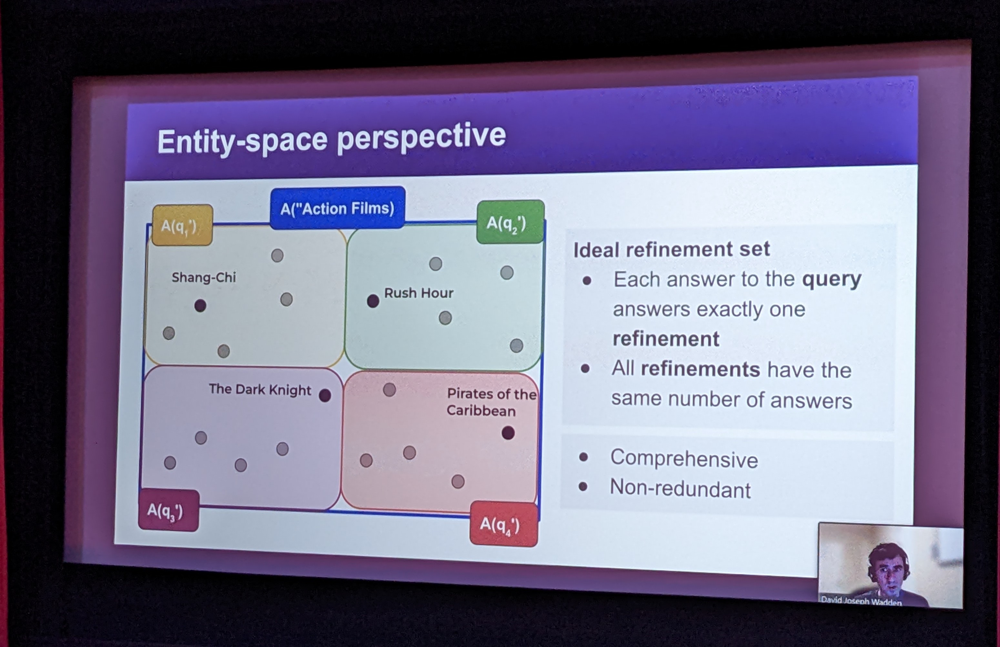
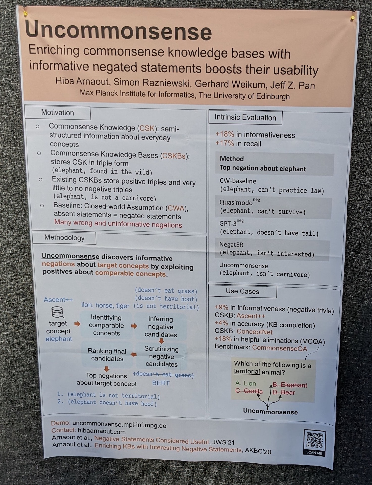

It's been more than 10 years since I presented one of my first papers at the first conference on Automated Knowledge Base Construction (AKBC)  in Grenoble in 2010 😬

I still remember how intimidated I felt by all those research stars with their proven track record, amazing papers, citations - and me, with my little paper that I needed to correct at last minute because I made a severe error in the evaluation code (my passion for [automated tests](https://www.slideshare.net/AnjaPilz/a-case-for-automated-tests) was born on that day 🐥). Still, I had a really good time, met many nice people and in the end managed to present my work.

10 plus years later, having switched from research and the Wikipedia-domain to industry and healthcare data, the number of challenges have rather increased, especially when tackling German data. In the (almost entire) absence of publicly available structured data, the need for automated knowledge base construction is even more pressing. That's why I went to London to attend AKBC2022! Great [schedule](https://www.akbc.ws/2022/schedule/), great [location](https://www.barbican.org.uk), Great Britain, here I come! 🙌

<i>Barbican Centre feels like a mixture of an old James Bond Movie and a huge terrarium - pretty cool!</i>

The remainder of this post is a (heavily biased) collection of the talks, links, repos, papers, (handy cam) pictures, ideas, thoughts… that I found most intersting. If you are looking for a detailed summary of the conference, you will not find that here, sorry 🤷‍♀

## Talks, Keynotes & Papers

### Partha Talukdar - [Temporal and Multilingual Knowledge Graphs](https://www.akbc.ws/2022/speakers/#parthaDetail)
🔈 [Partha Talukdar](https://parthatalukdar.github.io)

> The world is dynamic and Knowledge Graphs (KG) should reflect this time-varying nature. Temporal KGs provide a mechanism to represent this dynamism through time-scoped edges. While question answering over traditional KGs have received quite a bit of attention, QA over Temporal KGs is still in early stages. [...]

<i>Knowledge Graphs and Language Models.</i>

### Tom Hope - [CascadER: Cross-Modal Cascading for Knowledge Graph Link Prediction](https://www.akbc.ws/2022/papers/20_cascader_cross_modal_cascading)
🔈 [Tom Hope](https://tomhoper.github.io)

> Knowledge graph (KG) link prediction is a fundamental task in artificial intelligence, with applications in natural language processing, information retrieval, and biomedicine. Recently, promising results have been achieved by leveraging cross-modal information in KGs, using ensembles that combine knowledge graph embeddings (KGEs) and contextual language models (LMs). [...]

Cross modal means that we combine knowledge graph embeddings and text (language models).


<i>Example relation: "Aspirin" treats what?</i>

More on [CascadER](https://github.com/tsafavi/cascader).

### Jessie Tenebaum - [Data driven policy for pandemic response: data, knowledge, and action well outside of the ivory tower](https://www.akbc.ws/2022/assets/slides/Tenenbaum.pdf)
🔈 [Jesse Tenenbaum, Chief Data Office at DHHS](https://www.ncdhhs.gov/about/administrative-offices/data-office/jessie-tenenbaum)

> The "central dogma" of informatics, it has been said, is turning data into information and information into knowledge. Some take this framework further- knowledge informs action. Moreover, in the Learning Health System model, action begets more real-world data, which can be converted into information, etc. [...]

Really great talk with lots of puns and fun anecdotes!

<i>DIKA: Data, Information, Knowledge, Action</i>

<i>Data Strategy Framework</i>

<i>Probabilistic fuzzy match between data silos: for instance use soundex to handle typos</i>

Worth reading: NCDHHS’s [Data Sharing Guidebook](https://www.ncdhhs.gov/media/15509/open).

### Yordan Zaykov - [Project Alexandria in Viva Topics: AKBC in practice](https://akbc.ws/2022/assets/slides/yordan.pptx)
🔈 [Yordan Zaykov](https://www.microsoft.com/en-us/research/people/yordanz/)  

> At AKBC 2019, we presented Project Alexandria as a solution to inferring a knowledge base completely automatically from unstructured data. Since then, we have built Alexandria into the heart of a new Microsoft product called Viva Topics, launched last year. Viva Topics automatically constructs a knowledge base from an organization’s documents and intranet pages, and surfaces it across a wide range of Microsoft applications including SharePoint, Teams, Outlook and more. [...]

<i>Generative model of entity linking</i>

* Knowledge Base construction without looking at the data
* Entity fragments: pieces of the same entity that are not yet merged
* Supports multiple languages (tokenization and things like this might be needed to be adapted)
* More about [Project Alexandria](https://www.microsoft.com/en-us/research/project/alexandria/)

### Dipanjan Das - [Trustworthy Natural Language Generation with Communicative Goals](https://www.akbc.ws/2022/assets/slides/DipanjanDas.pdf)
🔈 [Dipanjan Das](https://www.dipanjandas.com)

> While recent work in large language models have made natural language generation fluent, these models suffer from content “hallucination”, where model-generated statements are not attributable to sources in communicative scenarios (e.g. summarization, question answering and responses in dialogue systems) [...]

<i>chatGPT preview 😁</i>



### Tom Hope - [NLP for Science: Advances and Challenges](https://www.akbc.ws/2022/assets/slides/TomHope.pdf)

> With over one million papers added every year to the PubMed biomedical index alone — the explosion of scholarly knowledge presents tremendous opportunities for accelerating research across the sciences. However, the complexity of scientific literature presents formidable challenges for existing AI and NLP technologies, limiting our ability to tap into this vast treasure trove of information. In this talk, I will present our recent work toward helping researchers and clinicians make use of knowledge embedded in the literature. […]

[Literature-Augmented Clinical Outcome Prediction](https://aclanthology.org/2022.findings-naacl.33.pdf): adding literature significantly reduces error (over 25% increase in precision@top-k scores)

🤔 Does this additional context also help for less complicated cases? I.e. patients that are not in the ICU?

### Angeliki Lazaridou - [Keeping LMs in sync with the real world](https://www.akbc.ws/2022/speakers/#AngelikiDetail)
🔈 [Angeliki Lazardiou](http://angelikilazaridou.github.io)

> Our world is open-ended, non-stationary and constantly evolving; thus what we talk about and how we talk about it changes over time. This inherent dynamic nature of language comes in stark contrast to the established static paradigm of NLP. This staticness has led over the years to a number of peculiarities; our models are “stuck” to the time they were trained, our systems are not designed to be easily adaptive, and our benchmarks further perpetuate this vicious circle.



Approach uses google queries but is therefore not strictly reproducible, as google results are prone to change: „If we stick on being reproducible, we are not going to make progress“

### Stephan Lewandowsky - [Anti-vaccination arguments: a conceptual taxonomy and a machine-learning model](https://www.akbc.ws/2022/assets/slides/lewandowsky.pdf)
🔈 [Stephan Lewandowsky](https://www.cogsciwa.com)

> [...] Through a preregistered systematic literature review and thematic analysis of anti-vaccination arguments, we developed a hierarchical taxonomy that relates common arguments and themes to 11 attitude roots that explain why an individual might express opposition to vaccination. We further validated our taxonomy on COVID-19 anti-vaccination misinformation, through a combination of human coding and machine learning using natural language processing algorithms. [...]

<i>Anti-vaccination arguments: a conceptual taxonomy and a machinelearning model</i>

[SetFit](https://github.com/huggingface/setfit)
* https://twitter.com/jitsuvax
* https://jitsuvax.info/conspiracist-ideation/big-pharma/

[QuALITY: Question Answering with Long Input Texts, Yes!](https://arxiv.org/pdf/2112.08608.pdf)
> To enable building and testing models on long-document comprehension, we introduce QuALITY, a multiple-choice QA dataset with context passages in English that have an aver- age length of about 5,000 tokens, much longer than typical current models can process. Un- like in prior work with passages, our ques- tions are written and validated by contributors who have read the entire passage, rather than relying on summaries or excerpts. [...]

[Entity-Centric Query Refinement](https://www.akbc.ws/2022/papers/19_entity_centric_query_refinemen)
> We introduce the task of entity-centric query refinement. Given an input query whose answer is a (potentially large) collection of entities, the task output is a small set of query refinements meant to assist the user in efficient domain exploration and entity discovery.

[Few-Shot Inductive Learning on Temporal Knowledge Graphs using Concept-Aware Information](https://www.akbc.ws/2022/papers/6_few_shot_inductive_learning_on)

> Knowledge graph completion (KGC) aims to predict the missing links among knowledge graph (KG) entities. Though various methods have been developed for KGC, most of them can only deal with the KG entities seen in the training set and cannot perform well in predicting links concerning novel entities in the test set.

## Poster Session

[Pseudo-Riemannian Embedding Models for Multi-Relational Graph Representations](https://www.akbc.ws/2022/papers/12_pseudo_riemannian_embedding_mo): This basically can handle two super similar entities that are not to be linked (sth you can’t do with gaussian spaces). Example: genes that are triggered by the same transcription factor but result in totally different proteins.

[UnCommonSense: Informative Negative Knowledge about Everyday Concepts](https://deepai.org/publication/uncommonsense-informative-negative-knowledge-about-everyday-concepts): Enriching commonsense knowledege bases with informative negated statements boosts their usability

Other interesting papers

* [Generative Multi-hop Retrieval](https://paperswithcode.com/paper/generative-retrieval-for-long-sequences), EMNLP 2022
* [Discovering Fine-Grained Semantics in Knowledge Graph Relations](https://arxiv.org/abs/2202.08917), CIKM 2022
* [Decoupling Knowledge from Memorization: Retrieval-augmented Prompt Learning](https://arxiv.org/pdf/2205.14704.pdf), NeurIPS 2022
* [CODEC: Complex Document and Entity Collection](https://arxiv.org/abs/2205.04546), SIGIR 2022
* [Towards Realistic Low-resource Relation Extraction: A Benchmark with Empirical Baseline Study](https://arxiv.org/abs/2210.10678), EMNLP 2022 (Findings)
* [Zero-shot Word Sense Disambiguation using Sense Definition Embeddings](http://malllabiisc.github.io/publications/papers/EWISE_ACL19.pdf), ACL 2019


## Impressions

... I spent a substantial amount of time waiting for tubes due to a [flooding](https://www.bbc.co.uk/news/uk-england-london-63496067)  
... I am still dumbfounded by the hotel prices in London 😑

